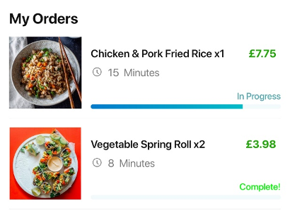

# Restaurant Ordering NFC Android
## Intro
Waiters in restaurants often spend a good proportion of their time explaining the menu to diners and taking orders from them; it would be good if they could spend more time helping deliver food to the restaurant tables and thus contribute to a speedier customer service.

The aim of this project is to develop a smart phone app that allows diners, once taken to a table, to register their arrival using NFC technology. Diners should then be able to browse the restaurant menu using a smart phone, and be provided with menu information that includes both standard information (e.g. dishes, prices, brief description), as well as an estimated time for specific dishes to be ready for serving. The smart phone app should also allow users to order their chosen dishes from the menu and monitor the progress of the order.

## Business Logic Flow
Diners at each table at the restaurant register their arrival by contacting their smartphone to the specific NFC chip on each table. This contact will send a request via the cloud to the management system to process it and send back a response for diners to browse the menu, place an order and watch the preparing process. At the backend, the management system updates the database and sends notifications to chef to cook, and to waiters to serve the table.

## Screenshots
### Registration
After successfully using NFC chips to react to the smartphone, the app is launched with a splash page and a registration page with the correct table number on it, as shown below.

### Main Menu
After typed the correct phone number, name, and diner quantity, the app launches the menu page controlled by HomeActivity, as shown below.

### Ordering and Progress Viewing
After the user selects their favourite dishes and adds them to the cart, they can see their cart by clicking the cart icon on the right top of the menu page. And when users confirm to order by clicking the "Order Now" button, they can see their progress with estimated preparation time in the progress bar. Here comes the cart, as shown below.

If the chefs have made actions on those dishes, the app can still see the latest results.

### Payment
After the user clicks "See Bill" button, the app will present a dialog enabling users to see their order summary.

After the user clicks the "Pay Now" button, the app will launch into the PayPal Sandbox checkout environment to complete the bill.

